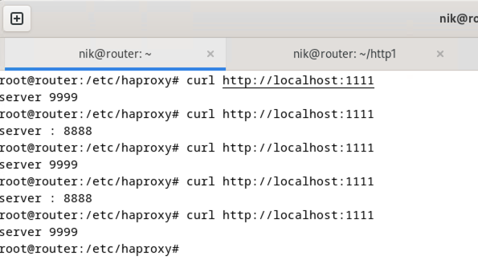
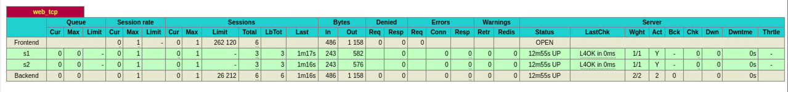
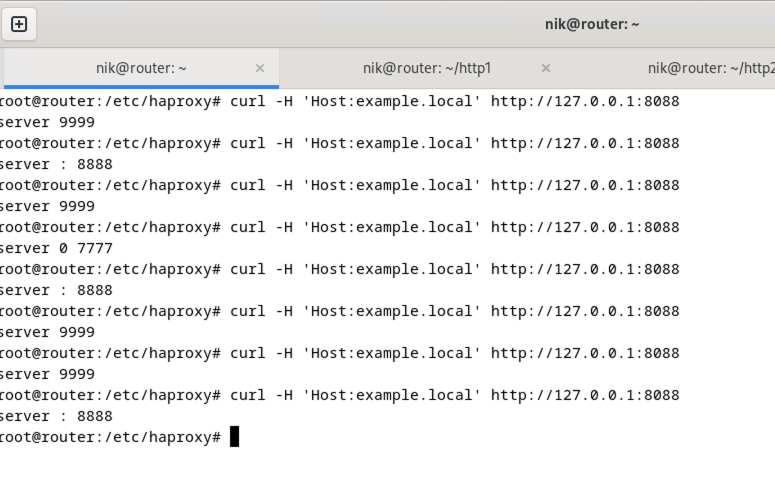
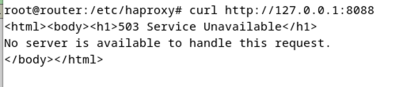
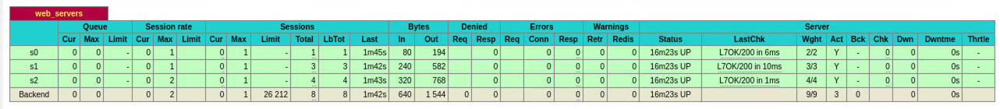

# Домашнее задание к занятию "`Кластеризация и балансировка нагрузки`" - `Кошель Николай Павлович`

### Задание 1
[haproxy_t1.cfg](haprox_t1_.cfg)  
 
  
 

### Задание 2
[haproxy_t2.cfg](haproxy_t2.cfg)  
 
  
 
  
 

